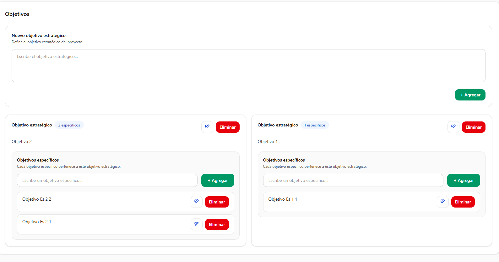
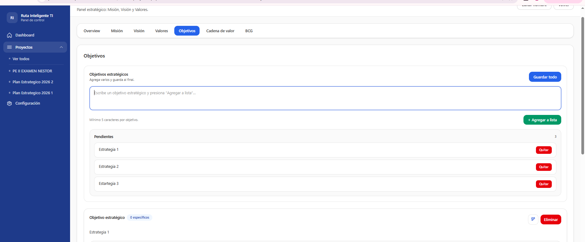
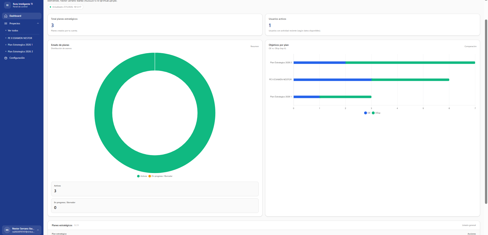

### Examen Práctica Unidad II - PETI

# Nombres y Apellidos: Nestor Juice Yomar Serrano Ibañez
# Fecha: 27/05/2026

Repositorio: https://github.com/NestorSnIbz/PE_II_EXAMEN_PRACTICO
URL: https://pe-ii-examen-practico.onrender.com/

# Mejora Realizada

En el overview se adjunto los objetos estrategicos y especificos de acuerdo a los objetivos que se plantean en el apartado de objetivos, mostrandose dentro de una tabla.

En el apartado de objetivos, anteriomente cuando se agregaba un objetivo estrategio o especifico se guardaba uno por uno haciendo que la pagina tenga que recargarse cada vez que se agrega uno, ahora se puede agregar mas de uno a lavez

En el apartado dashboard se integro graficos estadisticos, estados de planes y objetivos estrategicos vs objetivos especificos

